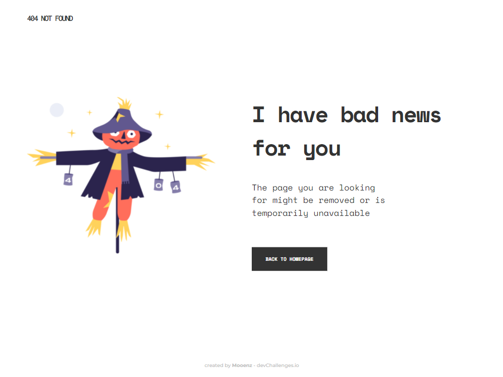

# **Portfolio DevChallenges**

Pequeño fragmentos de HTML, CSS/SCSS y JS :

## **Tabla de Contenido**

- [**Portfolio DevChallenges**](#portfolio-devchallenges)
  - [**Tabla de Contenido**](#tabla-de-contenido)
  - [**Responsive Web Developer**](#responsive-web-developer)
    - [404 Not Found](#404-not-found)
    - [My team page](#my-team-page)
    - [Interior Consultant](#interior-consultant)
    - [Recipe page](#recipe-page)
    - [My Gallery](#my-gallery)
    - [Checkout Page](#checkout-page)
    - [Edie homepage](#edie-homepage)
    - [Portfolio](#portfolio)

Los proyectos pertenecen a [Dev Challenges](https://devchallenges.io/).

## **Responsive Web Developer**

### 404 Not Found

[Look at code here](https://github.com/mooenz/portfolio-devchallenges/tree/main/404-not-found-master)

### My team page

[Look at code here](https://github.com/mooenz/portfolio-devchallenges/tree/main/)

### Interior Consultant

[Look at code here](https://github.com/mooenz/portfolio-devchallenges/tree/main/)

### Recipe page

[Look at code here](https://github.com/mooenz/portfolio-devchallenges/tree/main/)

### My Gallery

[Look at code here](https://github.com/mooenz/portfolio-devchallenges/tree/main/)

### Checkout Page

[Look at code here](https://github.com/mooenz/portfolio-devchallenges/tree/main/)

### Edie homepage

[Look at code here](https://github.com/mooenz/portfolio-devchallenges/tree/main/)

### Portfolio

[Look at code here](https://github.com/mooenz/portfolio-devchallenges/tree/main/)

