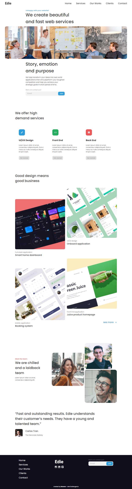
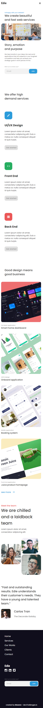

<!-- Please update value in the {}  -->

<h1 align="center">Edie homepage</h1>

   Solution for a challenge from  <a href="http://devchallenges.io" target="_blank">Devchallenges.io</a>.

  <h3>
    <a href="https://mooenz.github.io/portfolio-devchallenges/edie-homepage-master/">
      Demo
    </a>
     | 
    <a href="https://devchallenges.io/solutions/35JjxgfXOqp4rKogtqhn">
      Solution
    </a>
     | 
    <a href="https://devchallenges.io/challenges/xobQBuf8zWWmiYMIAZe0">
      Challenge
    </a>
  </h3>

<!-- TABLE OF CONTENTS -->

## Table of Contents

- [Table of Contents](#table-of-contents)
- [Overview](#overview)
  - [Built With](#built-with)
- [Features](#features)
- [Acknowledgements](#acknowledgements)
- [Contact](#contact)

## Overview

### Built With

- Html
- css/scss

## Features

This application/site was created as a submission to a [DevChallenges](https://devchallenges.io/challenges) challenge. The [challenge](https://devchallenges.io/challenges/xobQBuf8zWWmiYMIAZe0) was to build an application to complete the given user stories.

## Acknowledgements

- [Steps to replicate a design with only HTML and CSS](https://devchallenges-blogs.web.app/how-to-replicate-design/)

## Contact

- Website [mooenz.me](https://www.mooenz.me/)
- GitHub [@mooenz](https://github.com/Mooenz)
- Twitter [@mooenzdev](https://twitter.com/MooenzDev)

